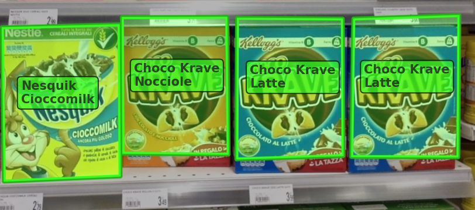
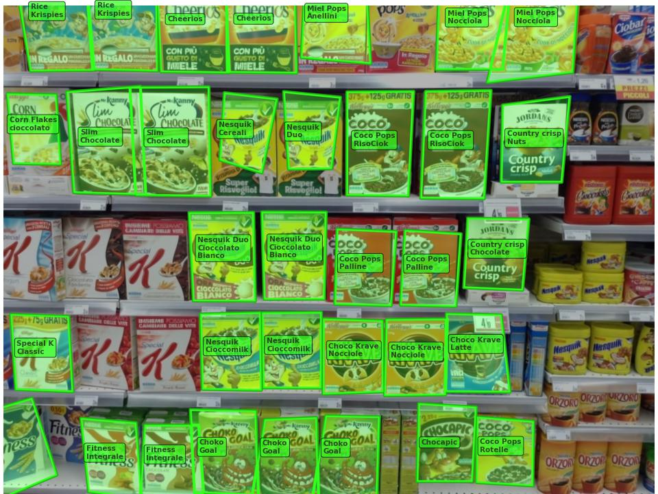

## Requirements
Python with Anaconda distribution and jupyter.

The following packages are needed:
 - ``openCV 4.5.5`` or higher
 - ``matplotlib``
 - ``scipy``
 - ``numpy``
 - ``shapely``

## Description

The overall tasks are developed in ``product_recognition.ipynb``.

The two class ``FeatureMatcher`` and ``MultipleInstanceMatcher``, contained in ``matcher.py``, are explained step by step in ``workflow.ipynb``.

## Report

You can read and download our report [here](./report/cv_report.pdf).

You can read the project assignment [here](./report/product-recognition-on-store-shelves.pdf).

## Result

### Step A - Single Product Detection

### Step B - Multiple Product Detection

### Step C - Multiple Product Detection

